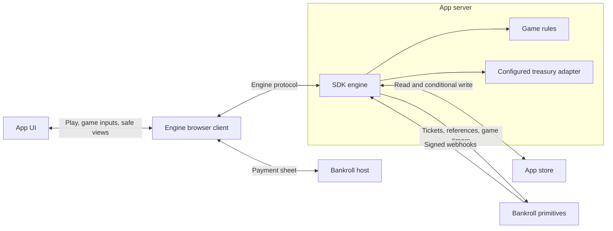

# P2P game engine

**Status: pay-and-play revision implemented and tested in the starter, 2026-09-21.**

This is the current specification for `engine/p2p`. The superseded intermediary notes have been removed to keep one design reference.

## 1. What we are building

A headless SDK engine for paid, asynchronous two-player games. Each player completes an independent, bounded round; the game compares their results. A player can start and finish before an opponent arrives. Word games and independently played shooting games fit this model.

An app supplies its rules, approved prices, treasury configuration and UI. The engine supplies the complete payment, matchmaking and round lifecycle. Changing the game's interaction model or presentation does not require copying its bookkeeping.

The engine includes a server lifecycle and a headless browser client. The client owns the complete player workflow; the server uses existing Bankroll primitives and the SDK store. It introduces no Bankroll payment service, generic job runner, recovery timer or requirement for matchmaking webhooks. Live shared simulations and alternating-turn games are outside this version's scope.

## 2. Ownership

| Owner | Responsibilities |
| --- | --- |
| Bankroll server | Matchmaking, managed-reference observation, game timers, signed webhook delivery and redelivery |
| SDK engine in the app server | Payment records and attempts; calls through the configured treasury adapter; ticket submission; round transitions; deadlines; match decisions; receipt validation; idempotent processing |
| Engine browser client | Entry intent, payment-sheet invocation, confirmation waiting, automatic start, command identity, reconnects and safe player projections |
| Game definition | Challenge generation, input validation, pure gameplay transitions, safe game views and comparison of completed results |
| App | Verified player authentication, server configuration, route binding, screens, animation, navigation and sound |

The engine stores its documents in the app's configured SDK store. A hosted treasury relay does not change payment ownership: the engine remains responsible for the payment lifecycle.



The initial implementation replaces the reusable behavior in `src/lib/p2p` with an encapsulated engine. The starter retains configuration and thin route bindings. Promotion to the SDK preserves the game-author API; an implementation recipe is no longer required to assemble the lifecycle.

## 3. Player lifecycle and default policy

**Tap Play → approve payment → briefly “Starting…” → gameplay → await the opponent if needed → receive the result and payment.**

One `play()` operation owns entry creation, payment, server confirmation and starting. There is no successful-payment path that asks the player to complete payment again or tap a second Start button. Those intermediate transitions are engine implementation details. The app renders one `starting` state while they complete.

These defaults preserve the original mode's player flow:

| Rule | Behavior |
| --- | --- |
| Entry price | $1 by default; the app can publish other approved offers |
| Creator fee | 10% of the combined pot on a win; configurable, with whole-cent validation before payment |
| Admission | A verified payment enters the queue automatically; the browser does not call `sync` |
| Starting | The client automatically starts after verified payment and accepted admission; an opponent is not required. The server fixes the game clock once. |
| Commitment | `play()` records intent to play if payment succeeds. A valid paid entry is committed even while confirmation or automatic start is pending. |
| Voluntary cancellation | The player may dismiss the host payment sheet before authorizing payment. The engine exposes no entry-cancellation operation, before or after payment confirmation. |
| Queue cutoff | 24 hours from recorded payment acceptance by default; the original absolute cutoff is also submitted as the ticket's `expiresAt` |
| Queue expiry | If authoritative cancellation succeeds, refund the stake, including for a player who already played. A match formed before the cutoff wins |
| No-show | Either paired player who has not started forfeits five minutes after `matchedAt`, even if that player has gone offline |
| Play duration | Defined by the game, with an explicit final submission deadline |
| Outcome | Compare two completed results; a completed player wins against a no-show; ties and double no-shows return both stakes without a fee |
| Payment delay | Leaves the agreed outcome and amount owed unchanged |

For a $1 entry and 10% fee, a win pays $1.80 and allocates $0.20 to the creator. If the treasury is the creator, its fee stays in the treasury. Ties refund $1 to each player. Amounts use HSUSD in whole cents; this version rejects other configured mints and does not claim arbitrary token precision.

A queue timeout closes the entry if no match exists. It cannot refund a matched stake independently of the match. Closing a browser page is not a server cancellation. A payment-sheet error can be ambiguous. The engine client retains the entry identity and charge key so resuming cannot create a second entry or silently abandon a paid one. Client disposal stops local observation; it does not cancel the entry. Unpaid references expire through the existing primitive. Automatic refunds remain available for queue expiry, invalid pay-ins and already-closed entries receiving a late payment.

## 4. Public API

The normal app API is the headless client in `engine/p2p/client`, with an optional React subscription hook in `engine/p2p/react`. It is part of the engine, not a recipe the app must reproduce.

```ts
const game = createP2PClient<GameView, Result>({ endpoint: '/api/game' });

await game.play();                // Optional { offerId }; completes entry through automatic start.
await game.resume(roundId);       // Reconnect; omit the ID to restore the retained workflow.
await game.act(action);           // Engine supplies sequence and a stable command ID.
await game.get(roundId);          // Read-only inspection.
await game.history({ cursor, limit });
const unsubscribe = game.subscribe(render);
game.getSnapshot();
game.dispose();                   // Stops local work; never cancels a paid entry.
```

A client snapshot has one `starting` phase for the whole pay-and-start operation, followed by `playing`, `finished`, or an actionable `error`. It includes a safe round view when available. Idle is the state before a play intent. The player projection does not include payment requests, internal `ready`/`awaiting_payment` states, `allowed.start`, or `allowed.cancel`. UI authors cannot accidentally turn those internal details into extra CTAs. An immediately completed game can transition directly to `finished`.

The client owns command IDs, same-input retries, active-entry persistence, charge idempotency, confirmation waiting, action sequence and reconnection. The app keeps one client for its active surface; concurrent calls on it share the operation rather than opening multiple payment sheets or creating duplicate entries. Lost responses retain the same operation identity. A definite payment-sheet dismissal leaves no new paid entry; an uncertain outcome remains associated with its original entry. Network failures retain enough state to resume. Observing confirmation may poll read-only state; it does not introduce server recovery timers or a browser-owned settlement worker. The existing webhook and game deadlines continue to own durable consequences when the browser is absent.

The client never starts an unpaid game, acknowledges an unconfirmed payment as paid, or restarts an existing game clock. Its normal successful call returns a running or completed round, rather than an instruction for the app to call `start`. Browser-side waiting and request retries are bounded/cancellable and clean up on disposal. Reloading or resuming an existing entry does not issue a fresh charge key.

Server configuration remains independent of UI:

```ts
const engine = createP2PEngine({ game: words, store, treasury, origin, offers });
export const POST = createP2PHandler({ engine, authenticate });
// authenticate(request) supplies a verified player Actor or null.
// The app verifies player eligibility in that callback.
export const POST = bankrollWebhook(engine.webhook); // In the separate webhook route.

await engine.inspect(operator, { wallet, roundId });
await engine.reconcile(operator, { wallet, roundId });
```

`createP2PEngine` exposes the engine-owned request dispatcher, webhook handlers and operator operations. It does not expose app assembly methods named `enter`, `start` or `cancel`. `createP2PHandler` binds the standard engine transport to verified authentication; apps do not write an operation switch or coordinate lifecycle calls. The browser protocol necessarily carries an internal payment request to the engine client, but that request never becomes a normal player-view field.

Cancellation is rejected at the server dispatcher for every new play intent, including before the payment webhook arrives. Hiding a button is not the enforcement. This removes the confirmation-delay race in which a payment could be locally cancelled while its receipt was still in transit. Existing persisted cancellations from the previous engine remain financial obligations and are honored; the new API cannot create them.

The internal server start transition still releases the accepted challenge and fixes the authoritative clock. It runs automatically through the engine client/server workflow once payment is accepted. Reads stay read-only. Payment webhooks perform admission without requiring a browser acknowledgement, and do not independently start a clock for a disconnected client.

Each accepted action records its identity, input fingerprint and acknowledgement with its transition. Retrying cannot score twice. The client owns `sequence`, which changes for gameplay transitions but not unrelated payment bookkeeping. Low-level snapshots and commands are internal protocol details, not the app integration surface.

## 5. Game contract and different UX

The game operates on its own state. It receives no store, payment record or matchmaking client. Both initialization and subsequent transitions return the same progress shape:

```ts
type Progress<State, Result> =
  | { status: 'running'; state: State; nextDeadlineAt?: number }
  | { status: 'finished'; state: State; result: Result };

const words = defineGame({
  id: 'words',
  version: 1,
  durationMs: 120_000,
  submissionGraceMs: 0,
  challenge,       // Deterministic generation from engine-supplied randomness.
  parseChallenge,  // Validate the accepted matchmaking payload.
  parseAction,     // Validate untrusted game input.
  start,           // context -> Progress
  step,            // state + action/deadline event + context -> Progress
  view,            // state + context -> permitted game view
  compare,         // two completed results -> 'a' | 'b' | 'tie'
});
```

Context supplies accepted challenge data, start time, end-of-play time, final submission cutoff and the effective event time. Randomness and command timing are fixed for a transition; retrying a conditional write cannot reroll a board. Hooks are synchronous and pure. Network validation inside a retried game hook is outside this version's contract.

The engine handles no-shows, ties, fees and the development opponent. `compare` receives two actual game results, including legitimate zero scores. It does not receive a null game as a stand-in for an absent player.

| Game style | Input to `act` | Game's responsibility |
| --- | --- | --- |
| Word game | A submitted word or tile path | Validate it, reject duplicate scoring, update state/result |
| Shooting game | Individual shot inputs or one bounded replay | Validate mechanics and input timing; compute the score itself |

A replay game declares a submission grace period. Input times must remain within the play window. The upload must reach server admission before the final cutoff and can be accepted only while the round has not been finalized. An end-of-round replay cannot also satisfy a per-action network-arrival limit. Deterministic replay verifies the simulated result; it does not prove that a human produced the inputs.

A game can request intermediate **gameplay** deadlines. At its fixed final cutoff it must return a terminal result. Delivery delays do not extend play: a deadline event is evaluated at its recorded deadline. A defective game hook is a visible system fault, not an invented player forfeit.

Command/deadline races are decided through conditional writes. Each command uses a fixed server admission time, checked against the applicable deadline and preserved if accepted. A deadline already committed cannot be undone by a late command. Rejected commands grant no additional play time. The acceptance tests must exercise both orderings.

The engine client manages command IDs, payment-sheet invocation, reconnects, confirmation waiting and automatic start. The app uses that workflow directly and supplies rendering and game inputs. Practice can reuse the pure game definition and UI without creating fake paid entries or converting practice results into paid results.

## 6. Pay-in and matchmaking processing

The internal entry preparation used by `play()` creates the managed reference and persists the expected payer, payee, asset, amount, memo, expiry and player charge key before returning the payment request. The accepted offer and treasury configuration are pinned to the entry. Hidden game conditions remain private until start.

Pay-in reference expiry closes an unaccepted payment request. The entry remains available for a later verified confirmation, which follows the cancelled-entry refund path rather than reopening admission. The UI must not offer an expired payment request.

The payment-confirmed handler performs the complete admission operation:

1. Validate the receipt against the entry and record the actual confirmed facts. One receipt can fund at most one entry.
2. If the entry was already closed by reference expiry or legacy cancellation, establish its watched refund instead of admitting it. A new play intent has no voluntary cancellation path.
3. Otherwise persist the original ticket input and queue cutoff, with the queue-deadline timer safely registered.
4. Submit `createTicket` using that stable ID and original input.
5. Record the response. If matched, process both players, establish applicable no-show deadlines, and settle if both rounds are terminal.
6. Acknowledge the webhook only after these consequences are complete or have the legitimate next event described below.

Already-recorded payment is not an early-return condition when admission is incomplete. A failed queue request makes the webhook fail. Redelivery repeats the original ticket request and obtains its current state, including a match committed before a lost response.

Current matchmaking pairs a new entrant with a compatible waiter. The entrant adopts the waiter's accepted challenge before it can start; the waiting player's already accepted challenge remains unchanged. Two already-played waiters are not subsequently paired by a background matcher. Compatibility includes game version and immutable economic/timing terms.

The same returned match contains both tickets. Processing does not depend on either player's browser remaining open. `start` also reconciles authoritative ticket status so a stale local waiting record cannot bypass a known no-show deadline. An invalid assignment cannot be undone by throwing: preserve it as a visible fault and withhold settlement until explicitly resolved.

**`match.created` is deferred and optional.** If later added, its authenticated handler calls the same idempotent match-processing function. The engine does not depend on that event in this design.

## 7. Financial ownership and automatic refunds

Before pairing, an entry document owns its stake and any refund obligation. After pairing, its match document owns the financial disposition. A completed payment is committed to the play intent; the new engine has no voluntary cancellation request or paid reservation screen.

Bankroll still arbitrates automatic queue expiry against matching:

- A final cancelled ticket at the queue cutoff permits the entry refund, whether or not the player played.
- A final matched ticket assigns financial disposition to its match record, even before all local projections are updated.

Legacy cancellation-in-progress records continue to complete their already-accepted obligations. They are not a supported operation for new entries.

Each match has one document containing immutable ticket identities, its result and its payout. The engine can create an empty match coordinator before preparing settlement. That creation alone neither decides a winner nor authorizes a transfer. The result and first watched payout attempt are committed together in this document.

Per-entry labels such as “paid out” are projections of the financial owner. They are not independent permission to refund. The design requires no atomic write across both entries and the match.

## 8. Managed references and outgoing payments

Managed references supply payment observations; the engine validates those observations against its records.

For a refund or match payout:

1. Determine the immutable recipients, asset, amounts and memo under the agreed rules.
2. Register a managed reference and prepare the transaction/provider attempt without sending.
3. Conditionally persist the financial decision with that attempt: reference, exact transaction material, attempt ID, signer mode and available signature/validity evidence.
4. Submit only the installed attempt through the configured treasury adapter.
5. Record the returned signature when available. A send response means submitted, not paid.
6. On confirmation, validate the receipt and mark the obligation paid.

The engine never submits an attempt that lost its installation race. The reference registration/installation protocol in the appendix prevents an already-consumed reference event from leaving an unwatched attempt.

| Adapter/evidence | Permitted recovery |
| --- | --- |
| Fixed signed transaction | The exact signed bytes can be resubmitted with the same transaction identity |
| Fixed transaction proven unpaid and no longer executable | A new watched attempt may replace it under the same obligation |
| Hosted sign-and-send adapter | Follow only its documented execution/idempotency guarantees; the unsigned transaction's blockhash does not bound a transaction the provider can rebuild |
| Attempt remains ambiguous | Preserve the obligation and attempt; expose `needs_attention` when automatic processing cannot safely proceed |

**Reference expiry alone does not authorize a new payout.** It ends observation. The engine must distinguish “did not pay and cannot execute” from “no payment was observed.” It retains prior attempts and receipts when replacing an attempt.

Reconciliation requires RPC history sufficient to establish the attempt's outcome. A failed query or an endpoint that cannot supply the required history is not proof of nonpayment.

For the current hosted adapter, this specification does not promise safe automatic replacement after an ambiguous submission or expired idempotency window. A send is durably claimed before invocation; if its execution cannot be established, the engine preserves that attempt for reconciliation. It must not issue a fresh transfer merely to clear a stuck status. An engine-owned, authenticated operator reconciliation operation can resolve it when evidence becomes available. Fully automatic replacement requires a demonstrated adapter guarantee, not a new assumption in game code.

Malformed pay-ins never admit play. Record the actual receipt. Whole-cent funds received in the configured supported asset can be returned to the actual payer through the same refund machinery, with receipt deduplication. Unsupported assets/precision remain visible for reconciliation. An observation mismatch is not evidence that nothing reached the treasury. This does not introduce a charge-intent service or automatic scanning for hypothetical extra payments.

## 9. Timers and webhook acknowledgement

There are three timer purposes:

| Timer | Business meaning | Completion |
| --- | --- | --- |
| Queue | The accepted wait period has ended | Obtain cancelled/matched disposition and complete the resulting entry/match processing |
| No-show | An unstarted matched player's window has ended | Record the forfeit and complete any now-due match decision |
| Game | A declared gameplay or submission deadline has arrived | Apply the game's deadline transition and complete resulting finalization |

There is **no recovery timer, periodic retry timer or settle-refund timer**. Ordinary state writes do not register timers. Register a timer when establishing a deadline; replace it only when the game's next deadline changes. Invalidated timers may still arrive and are recognized by identity.

Store the exact business deadline separately from Bankroll's scheduled delivery time. The current SDK schedules in whole relative minutes; use `max(1, ceil((deadline - now) / 60_000))`. Commands enforce the recorded cutoff. A late webhook grants no additional play.

A webhook is an operation that may span several idempotent writes and external calls. It returns `200` only when its required consequences are complete or responsibility has passed to an already-established legitimate event—for example, a watched payout attempt. Writing a pending action alone is insufficient. Operational failures propagate so the existing delivery is retried.

There is one explicit terminal handling case: when automatic execution cannot safely proceed, durably record `needs_attention`, the unpaid obligation and the reason/evidence for operator reconciliation before acknowledging. This acknowledges the observation and the manual handoff, not successful payment. It must be visible in the payment record and operator inspection; a log message alone is insufficient. Transient failures continue to fail delivery rather than being converted into this state.

### Early finish and interrupted requests

A started round already has a genuine game-deadline timer. Finishing early does not discard that registration before terminal processing is complete. If a player request records its result and stops before completing match finalization, that existing game-deadline delivery can finish the operation. It is not replaced with a retry timer.

If the internal start transition returns an immediately finished game, it has the same requirement: establish the finalization handoff before retiring the entry's existing queue/no-show deadline registrations. Immediate completion cannot leave a persisted result with no owner for its remaining consequences.

When a round finishes without an opponent, its queue-deadline timer and any later entrant's admission processing cover the remaining lifecycle. When a matched round finishes first, the other player's game/no-show event covers their unfinished play. Before clearing a finalization event, the engine must establish the applicable handoff; merely seeing `finished` or an existing match document is insufficient.

If a game/no-show/queue webhook encounters an operational failure during its own consequences, it fails that delivery. Redelivery resumes those consequences. It does not create another timer to retry them. Once a payout is installed, its reference events own payment follow-up.

## 10. Failure behavior that the implementation must demonstrate

| Interruption | Required behavior |
| --- | --- |
| Pay-in recorded, queue submission fails | Payment webhook fails; redelivery submits the same ticket |
| Match committed, queue response lost | Identical ticket retry returns the match; both players are processed |
| One player updated, processing the second fails | The originating operation remains incomplete and resumes both-side processing idempotently |
| Payment returns before webhook delivery | The client remains `starting`, waits and automatically starts after confirmation; no extra CTA or charge |
| Start response lost | The client resumes the same entry and start identity, returning the same challenge and clock |
| Double Play tap or reload during entry | One persisted play intent and charge key; no duplicate entry or payment sheet |
| Voluntary cancellation sent before/after receipt delivery | Server rejects the operation; a paid play intent remains committed |
| Final action accepted, response lost | No duplicate scoring; the command or still-actionable game-deadline delivery completes finalization |
| Payout installed, process stops before/during send | Reference events resume payment handling according to the adapter's evidence; uncertainty is retained |
| Timer/reference event arrives before its prepared write | It fences that preparation before acknowledgement; an expired event cannot subsequently be installed as future work |
| Event delivered twice or out of order | Completed effects remain completed; incomplete consequences continue |
| Payment is delayed | Display the established result and pending payment; do not change the award |
| Infrastructure or game code has a permanent fault | Expose a diagnosable unresolved state; do not fabricate success, a player forfeit or a refund |

Redelivery assumes Bankroll's existing delivery service and the app eventually become available. Exhausted delivery attempts and permanent faults use existing webhook replay/operational reconciliation; timers do not provide a second retry scheduler.

## 11. Versioning, integration and acceptance

Persist game version, accepted challenge, economic policy and treasury identity with the entry. Existing paid rounds continue under their pinned definitions after deployment. Missing definitions or signing authority are explicit faults; upgrading an app cannot silently redirect a payout or make a paid round appear nonexistent.

An app binds the engine to verified sessions, its existing SDK store/treasury configuration and the webhook route. The starter itself remains an unbound skeleton; the engine README supplies the integration examples. UI remains replaceable. Framework and environment dependencies stay in those bindings so the engine can move to the SDK without rewriting game rules.

Before implementation is accepted:

- Exercise a streamed-action word game and a shooting/replay game through the same public API, including two real simulated players.
- Test wins, ties, no-shows, queue expiry, rejection of voluntary cancellation, and late payment after automatic closure.
- Test duplicate/lost commands, repeated webhooks, matching against queue expiry, immediate completion during automatic start, and interruptions in the table above.
- Exercise the real client/server transport with delayed confirmation, lost start/action replies, payment-sheet dismissal, ambiguous charge results, double taps, disposal and reconnects.
- Assert the public client view never exposes a payment quote, manual start/cancel permission or an intermediate ready state.
- Assert the standard server dispatcher rejects cancellation before and after payment is recorded.
- Prove that ordinary reads perform no writes, sends or lifecycle transitions.
- Prove that only declared business deadlines create timers and that no timer changes an earned payout into a refund.
- Test the payout adapter's actual replay/retirement guarantees, including preserved hosted uncertainty.
- Test receipt validation and the rule that one receipt cannot fund or refund multiple entries.
- Test early timer/reference delivery, conditional-write conflicts, old game versions and deadline/action ordering.
- Run the repository's environment isolation checks, applicable tests, typecheck and lint without moving real funds.

Approval of this document approves the ownership, lifecycle, public API direction and failure behavior above. It does not claim implementation or payment-provider guarantees have already been validated.

## Appendix: registration and conditional writes

This is internal engine bookkeeping, not a game-author API or another scheduling system.

A newly registered timer, pay-in reference or payout reference targets an existing document. Each document has a monotonically increasing storage revision; conditional writes use its SDK etag. Creation of a harmless entry/match shell can precede registration, but it must not expose a charge or authorize a payout before initialization completes.

For a transition introducing an external event:

1. Read the exact document revision/etag and calculate the transition.
2. Register the event with metadata identifying the document, preparation token and base revision.
3. Commit the state plus the active event identity against that exact etag.
4. If the write loses, discard that preparation. Reread and recompute; do not attach it to a different revision.

An event for an installed identity processes the current document and its unfinished consequences. A terminal event for a preparation that is not installed must not be blindly acknowledged: if the document is still at the preparation's base revision, conditionally increment the revision to invalidate that pending write. If a later revision already made the write impossible, the event is stale. All writes preserve increasing revisions, and IDs are not reused.

The revision increment changes actual document contents because the filesystem backend hashes contents for its etag. A delivery and its prepared write therefore compete on one conditional write: either the state is installed and the event processes it, or the event invalidates the preparation. The same rule covers a reference expiring while a payout preparer or an entry-initialization request is paused. An expired preparation cannot later be exposed as a live payment request.

Retaining an active timer token does not require re-registering that timer on unrelated writes. Event identity and completion of its consequences determine when it becomes safe to acknowledge or retire it.
